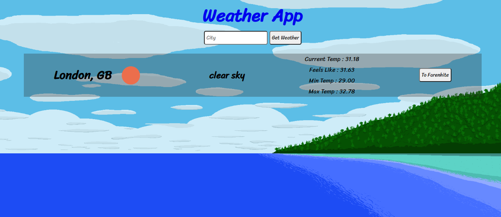

<h1 align="center">Weather App</h1>

<div align="center">

[](http://raw.githack.com/alishabab/js-weather-app/weather-feature/dist/index.html)
[](https://github.com/alishabab/cloning-thenextweb/issues)
[](https://github.com/alishabab/js-weather-app/pulls)
[](https://github.com/alishabab)
[](/LICENSE)

</div>

---

## 📝 Content
<p align="center">
<a href="#about">About</a>&nbsp;&nbsp;&nbsp;|&nbsp;&nbsp;&nbsp;
<a href="#installing">Installing</a>&nbsp;&nbsp;&nbsp;|&nbsp;&nbsp;&nbsp;
<a href="#built_using">Built with</a>&nbsp;&nbsp;&nbsp;|&nbsp;&nbsp;&nbsp;
<a href="#authors">Authors</a>
</p>


## 🧐 About <a name = "about"></a>
<h3 align="center">In this project I built a weather app in JavaScript. User can enter a city name in the input box to get weather data of that city. <br>It uses data from OpenWeatherMap API and renders it to display. I used async/await to perform asynchronous tasks and fetch api to make get requests.</h3>
<p align="center">
  <a href="" rel="noopener">
 </a>
</p>

---

## 🔧 Built with<a name = "built_using"></a>

- HTML, CSS and JavaScript
- OpenWeatherMap Api 
- Webapack to bundle modules
- Stylelint and ESLint for linting errors

## 🔴 Live Demo

[Live Demo](http://raw.githack.com/alishabab/js-weather-app/weather-feature/dist/index.html)

### 🛠 Installing <a name = "installing"></a>

```
- Clone or download this repository
- Unpack (if downloaded)
- run `npm install` to download dependencies
- run `npm run start` to start development server

```
## ✒️  Authors <a name = "authors"></a>


👤 **Shabab Ali**

- Github: [@alishabab](https://github.com/alishabab)
- Twitter: [@shabab_ali](https://twitter.com/shabab_ali)
- Linkedin: [@shababali](https://www.linkedin.com/in/shababali/)


## 🤝 Contributing

Contributions, issues and feature requests are welcome!

Feel free to check the [issues page](/issues).


## 👍 Show your support

Give a ⭐️ if you like this project!


## 👊 Acknowledgments

[The Odin Project](https://www.theodinproject.com/courses/javascript/lessons/weather-app)
[Microverse](https://microverse.org)
[OpenWeatherMap](https://openweathermap.org)


## 📝 License

This project is free to use as learning purposes. For any external content (e.g. logo, images, ...), please contact the proper author and check their license of use.
